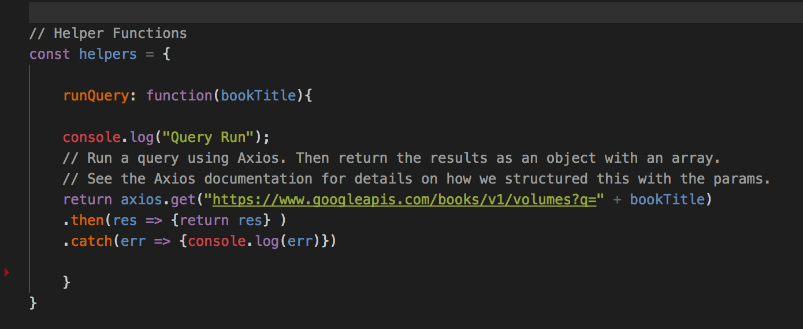
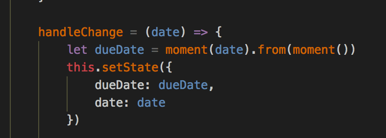

# LibIQ

## About 
- Libiq helps users track books they get from the library so they can know when its and return it on time.
- Libiq was built with React Js, Node, Express with a MongoDb database

## Collaborators
- Taiwo Tejuosho (Front End)
- Ola Giwa (Back End)

## Screenshots
### User Home

### Log In Page

### SignUp Page

### Added Books Page

## Who Uses Libiq
- Anyone who gets books from the library 

## How it works
### At the MVP Level, the User Adds a Book and we pull the books details from the Google Books API.

### Calculate time remaining using the Moment Js Library

## Usage
### First, 
- yarn install in root folder and client folder and 
- yarn start to launch.