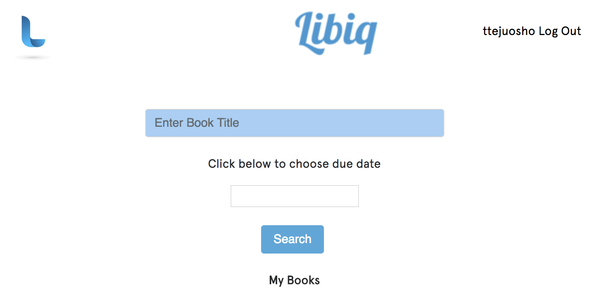
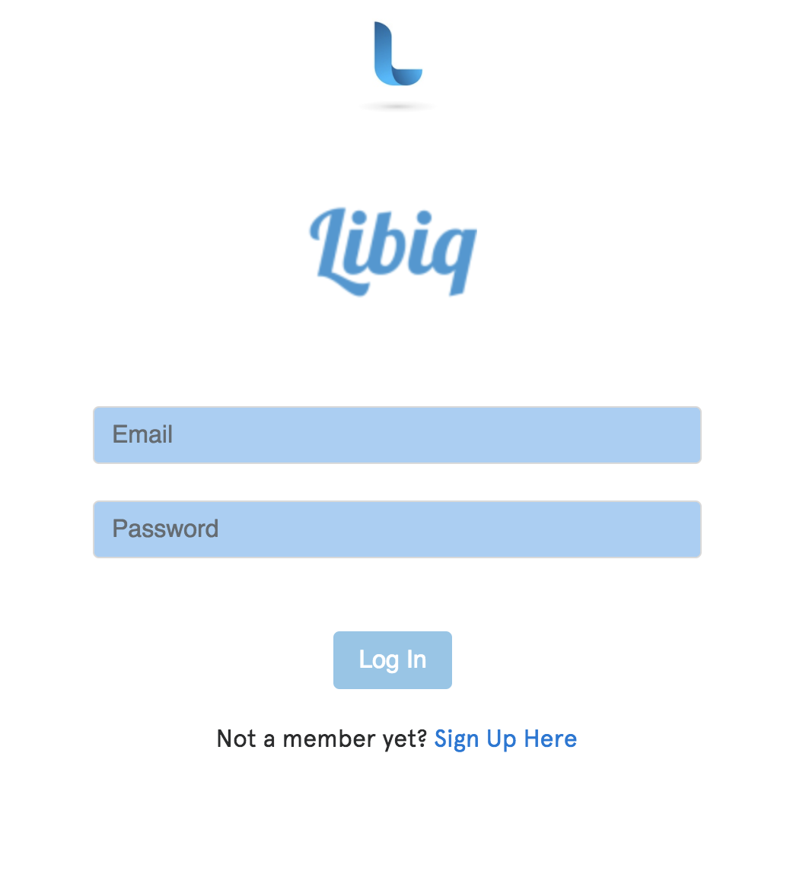
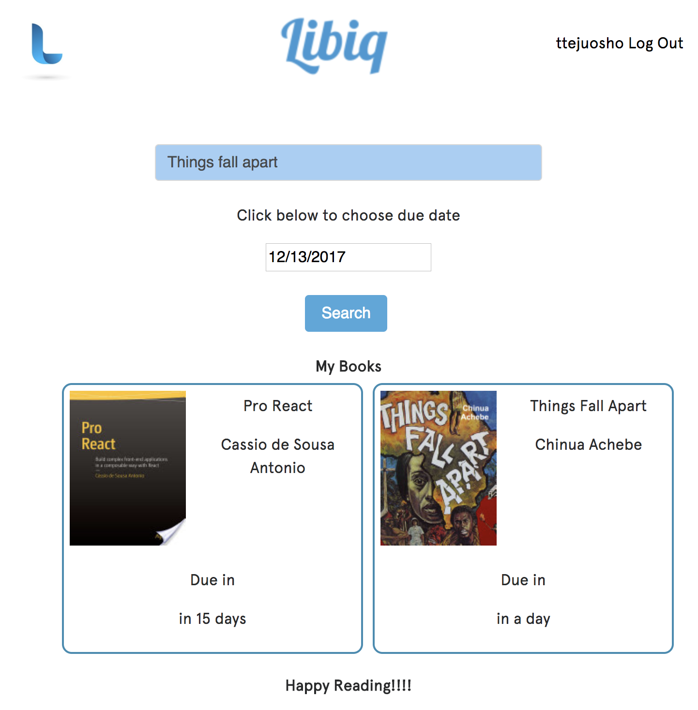

# LibIQ

## About 
- Libiq helps users track books they get from the library so they can know when its and return it on time.
- Libiq was built with React Js, Node, Express with a MongoDb database

## Collaborators
- Taiwo Tejuosho (Front End)
- Ola Giwa (Back End)

## Screenshots
### User Log in Page

### Log In Page

### SignUp Page

### Added Books Page

